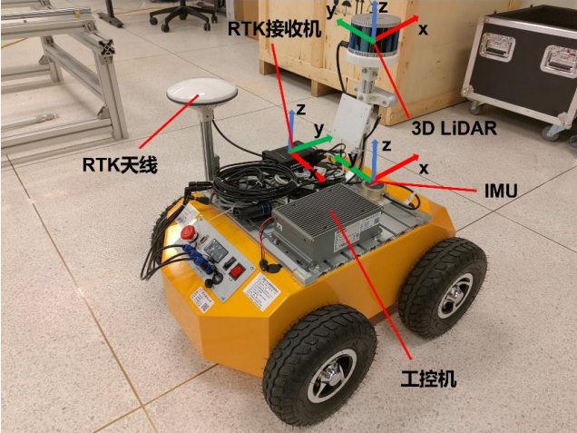

# LiDAR-RTK Odometry

This is a project for my undergraduate degree. It is based on a LiDAR and an RTK for stable and highly accurate pose estimation. 



## Dependency
- ubuntu 20.04
- ROS
- eigen3
- g2o
- pcl  1.7
- glog
- yaml-cpp

## Build & Run
``` shell
# Build
mkdir -p catkin_ws/src && cd catkin_ws/src
catkin_init_workspace
git clone https://github.com/lxh3181515/lidar_RTK.git
cd ..
catkin_make

# Run
source devel/setup.bash
roslaunch lidar_RTK run.launch
```
